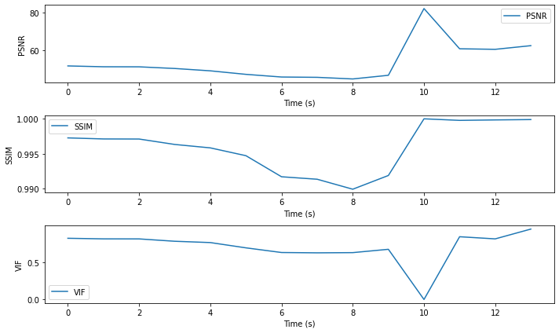

# 영상 최적화를 위한 MP4와 WebM 간의 품질 비교 분석

본 문서에서는 mp4에서 webm으로의 비디오 형식 전환 후 발생할 수 있는 영상 품질 차이에 대한 신뢰할 수 있는 구체적인 지표를 제공하고자 합니다.

이를 위해, 피크 신호 대 잡음비 (PSNR), 구조적 유사성 지수 (SSIM), 그리고 시각 정보 충실도 (VIF)를 이용하여 두 비디오 형식 간의 품질 차이를 측정하였습니다. 이 세 가지 지표는 이미지와 비디오 품질 분석에서 널리 사용되는 지표들로, 각각 다양한 측면의 품질 변화를 반영할 수 있습니다.

문서의 코드는 Python으로 작성하였습니다.

## 용어 정리

- **피크 신호 대 잡음비** (PSNR, Peak Signal-to-Noise Ratio): PSNR은 이미지 또는 비디오의 품질을 측정하는 일반적인 방법입니다. 이 값이 클수록 원본과의 차이가 적다는 것을 의미합니다. 즉, 높은 PSNR은 원본 영상에 대한 복제본의 품질이 높다는 것을 의미합니다. 일반적으로 PSNR 값이 30 이하면 낮은 품질, 30~50 사이면 중간 품질, 50 이상이면 높은 품질로 간주합니다.
- **구조적 유사성 지수** (SSIM, Structural Similarity Index): SSIM은 두 이미지 또는 비디오가 얼마나 구조적으로 유사한지를 측정하는 지표입니다. 이 값은 -1과 1 사이의 값으로 측정되며, 1은 완벽한 일치를 나타냅니다.
- **시각 정보 충실도** (VIF, Visual Information Fidelity): VIF는 원본과 압축된 이미지 또는 비디오 사이의 시각적 품질을 측정하는 지표입니다. 이 값이 높을수록 원본과의 시각적 차이가 적다는 것을 의미합니다. VIF는 원본에서 중요한 정보가 얼마나 잘 보존되었는지를 판단하는 데 사용됩니다.

## 데이터 선정과 분석 전략

분석에서는 3840 x 1168의 해상도를 가진 landing_page_hero_mv.mp4와 landing_page_hero_mv.webm 영상을 대상으로 하였습니다. 13초 길이의 각 영상은 총 420개의 프레임으로 이루어져 있어, 전체 프레임을 분석하는 데 예상 연산 시간이 7~8시간에 이르는 것으로 계산되었습니다. (한 프레임을 처리하는 데 걸리는 시간 \* 전체 프레임 수)

```
Elapsed time: 63.93s, Estimated remaining time: 26787.89s
```

프레임을 많이 분석하게 되면 영상의 전체 품질에 대한 평가가 더욱 정확해질 수 있습니다. 그러나, 이러한 방법은 연산에 많은 시간이 소요되며, 실용적인 한계가 있습니다. 따라서, 각 초마다의 시점에서 프레임을 샘플링하는 방식을 선택하였습니다. 그렇기에 분석 결과가 전체 품질을 완벽하게 반영하지는 못할 수도 있다는 점을 인지하고 있습니다.

그러나 각 13개의 프레임은 영상에서 균일하게 선택되었고, 다양한 장면과 상황을 대표하고 있다고 판단하였습니다. 이로 인해, 분석 결과는 영상의 품질을 객관적이고 신뢰성 있는 방식으로 평가하는 추정치를 제공할 수 있을 것이라고 예상합니다.

## 영상 품질 비교를 위한 분석

```python
import cv2
import numpy as np
from skimage.metrics import structural_similarity as ssim
from sewar import full_ref
import time

# 비디오 파일 열기
cap1 = cv2.VideoCapture('landing_page_hero_mv.mp4')
cap2 = cv2.VideoCapture('landing_page_hero_mv.webm')

# 프레임 속도
fps = cap1.get(cv2.CAP_PROP_FPS)

# 두 비디오의 프레임 수가 같은지 확인
assert cap1.get(cv2.CAP_PROP_FRAME_COUNT) == cap2.get(cv2.CAP_PROP_FRAME_COUNT), "Videos must have same number of frames"

# PSNR, SSIM, VIF의 평균값을 계산하기 위한 리스트
psnr_values = []
ssim_values = []
vif_values = []

# 시간당 한 번 계산
seconds = list(range(14))

for second in seconds:
    cap1.set(cv2.CAP_PROP_POS_FRAMES, second*fps)
    cap2.set(cv2.CAP_PROP_POS_FRAMES, second*fps)

    ret1, frame1 = cap1.read()
    ret2, frame2 = cap2.read()

    # 비디오의 끝에 도달하면 루프를 종료
    if not ret1 or not ret2:
        break

    # PSNR 계산
    psnr = cv2.PSNR(frame1, frame2)
    psnr_values.append(psnr)

    # SSIM 계산
    ssim_value = ssim(frame1, frame2, multichannel=True)
    ssim_values.append(ssim_value)

    # VIF 계산
    vif = full_ref.vifp(frame1, frame2)
    vif_values.append(vif)

    print(f'Second: {second} - PSNR: {psnr}, SSIM: {ssim_value}, VIF: {vif}')

# 평균 PSNR, SSIM, VIF 계산
mean_psnr = np.mean(psnr_values)
mean_ssim = np.mean(ssim_values)
mean_vif = np.mean(vif_values)

print(f'\nMean PSNR: {mean_psnr}')
print(f'Mean SSIM: {mean_ssim}')
print(f'Mean VIF: {mean_vif}')
```

    Second: 0 - PSNR: 51.72941644023464, SSIM: 0.9972663462534271, VIF: 0.8238966366307613
    Second: 1 - PSNR: 51.28016002423844, SSIM: 0.9971142961895142, VIF: 0.8159751194658345
    Second: 2 - PSNR: 51.247383723464296, SSIM: 0.9971027794204, VIF: 0.815474394953355
    Second: 3 - PSNR: 50.36723361153162, SSIM: 0.9963271937936011, VIF: 0.7838099644493267
    Second: 4 - PSNR: 49.1149894058391, SSIM: 0.9958364227061036, VIF: 0.7661798912647524
    Second: 5 - PSNR: 47.23720458773596, SSIM: 0.9947189440742056, VIF: 0.6951382447109715
    Second: 6 - PSNR: 45.81661090893473, SSIM: 0.9917016366640565, VIF: 0.6323098097941838
    Second: 7 - PSNR: 45.65164671184295, SSIM: 0.9913484958726788, VIF: 0.628003489702675
    Second: 8 - PSNR: 44.78948518622921, SSIM: 0.9899206244938963, VIF: 0.6307590663669763
    Second: 9 - PSNR: 46.73905964203763, SSIM: 0.9918846697261742, VIF: 0.6756128021246756
    Second: 10 - PSNR: 82.30843610424631, SSIM: 0.9999958685800859, VIF: 3.239495864250043e-07
    Second: 11 - PSNR: 60.86661305508816, SSIM: 0.9997719803612922, VIF: 0.8448046019077773
    Second: 12 - PSNR: 60.575473875847436, SSIM: 0.9998375861439448, VIF: 0.815901291358989
    Second: 13 - PSNR: 62.52757422090148, SSIM: 0.9998884451282345, VIF: 0.9477504819046526

    Mean PSNR: 53.58937767844085
    Mean SSIM: 0.9959082349576869
    Mean VIF: 0.7054011513274654

#### 결과 분석

- PSNR(Peak Signal-to-Noise Ratio)는 약 53.59로 매우 높습니다. 이는 두 영상 간에 중요한 차이가 거의 없음을 나타냅니다. PSNR 값이 높을수록 두 영상 사이의 차이가 적습니다.
- SSIM(Structural Similarity Index)은 약 0.9959로, 1에 매우 가까워 두 영상의 구조적 유사성이 매우 높음을 나타냅니다. SSIM 값이 1에 가까울수록 두 영상의 구조적 유사성이 높다는 것을 의미합니다.
- VIF(Visual Information Fidelity)는 약 0.7054로, 두 영상 간에 약간의 차이가 있음을 나타냅니다. VIF 값이 1에 가까울수록, 두 영상이 사람의 눈에 똑같이 보인다는 것을 의미합니다.

PSNR 및 SSIM은 두 영상이 매우 유사하다는 것을 나타내지만, VIF 값은 약간의 차이가 있음을 보여줍니다. 이는 눈으로 볼 때 두 영상 사이에 약간의 차이를 인지할 수 있음을 의미할 수 있습니다.

## 초당 분석 결과 시각화

```python
import matplotlib.pyplot as plt

# 시간(초) 벡터 생성
time = list(range(14))

# 그래프 생성
plt.figure(figsize=(10, 6))

# PSNR 그래프
plt.subplot(3, 1, 1)
plt.plot(time, psnr_values, label='PSNR')
plt.xlabel('Time (s)')
plt.ylabel('PSNR')
plt.legend()

# SSIM 그래프
plt.subplot(3, 1, 2)
plt.plot(time, ssim_values, label='SSIM')
plt.xlabel('Time (s)')
plt.ylabel('SSIM')
plt.legend()

# VIF 그래프
plt.subplot(3, 1, 3)
plt.plot(time, vif_values, label='VIF')
plt.xlabel('Time (s)')
plt.ylabel('VIF')
plt.legend()

# 그래프 표시
plt.tight_layout()
plt.show()
```



초당 분석 결과를 시각화한 결과입니다.

특정 구간(10초)에서 PSNR과 SSIM은 각각 높은 값을 가짐으로써 두 영상이 매우 유사하다는 것을 나타내는 반면, VIF 값이 매우 낮게 나옵니다. 이렇게 낮은 VIF 값은 두 영상 사이에 극도로 차이가 있는 경우에 나타날 수 있지만, PSNR과 SSIM 값이 매우 높은 것을 고려하면 이상치(Outlier)로 판단됩니다.

문제 구간을 확인하기 위해 이상치 구간의 프레임을 시각화하였습니다.

```python
import cv2
import matplotlib.pyplot as plt

def display_frame(video_path, sec):
    cap = cv2.VideoCapture(video_path)

    fps = cap.get(cv2.CAP_PROP_FPS)
    frame_no = int(fps * sec)

    cap.set(cv2.CAP_PROP_POS_FRAMES, frame_no)

    ret, frame = cap.read()

    if not ret:
        print(f"Frame not read correctly at second {sec} for {video_path}")
        return

    # BGR에서 RGB로 변환
    frame_rgb = cv2.cvtColor(frame, cv2.COLOR_BGR2RGB)
    plt.imshow(frame_rgb)
    plt.show()

    cap.release()

# 예시
display_frame('landing_page_hero_mv.mp4', 5)

display_frame('landing_page_hero_mv.mp4', 10)
display_frame('landing_page_hero_mv.webm', 10)
```


첫 예시로 볼 수 있듯이 특정 구간의 프레임을 추출하는 코드입니다.

이상치에 해당하는 프레임은 아무 정보가 없는 단색 프레임입니다. PSNR과 SSIM은 두 이미지 또는 비디오 간의 절대적인 픽셀 차이나 구조적 차이를 측정하는 데 사용되므로, 두 비디오 모두 동일한 단색 프레임을 보여줄 경우 이들의 값이 높게 나올 수 있습니다. 반면에 VIF는 인간 시각의 특성을 고려하여 품질을 평가하므로, 완전한 단색 프레임에서는 별도의 시각적 정보가 없다고 판단하여 점수가 매우 낮게 나올 수 있습니다.

## 결론

피크 신호 대 잡음비, 구조적 유사성 지수, 시각 정보 충실도 세가지 메트릭을 사용하여 압축 전, 후 영상을 비교분석하였습니다.

단순 수치로는 피크 신호 대 잡음비 및 구조적 유사성 지수는 두 영상이 매우 유사, VIF 값은 약간의 차이가 있음으로 해석하였습니다. 하지만 이는 단색 프레임 특성 상 나오는 문제였으므로 이상치를 제거하고 평균을 다시 구해야합니다.
이상치를 제거한 평균은 다음과 같습니다.

```
# Without outlier

Mean PSNR: 51.08
Mean SSIM: 0.9965
Mean VIF: 0.7580
```

상대적으로 VIF 값이 다소 낮기 때문에, 특정 상황에서 인간의 눈으로 보았을 때 두 비디오 간에 차이를 느낄 수 있음을 의미합니다. 그러나 전체적인 품질 지표들이 상당히 높게 나타나기에 원본 비디오와 인코딩된 비디오 간에 큰 차이가 없다고 판단할 수 있습니다.
